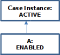
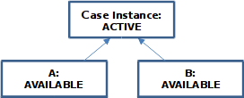

---

title: 'Repetition Rule'
sidebar_position: 40

menu:
  main:
    identifier: "cmmn-ref-markers-repetition-rule"
    parent: "cmmn-ref-markers"
    description: "Controls whether a Task, Stage or Milestone can have repetitions."

---

**Can be used with**: [Task](../reference/cmmn11/tasks/index.md), [Stage](../reference/cmmn11/grouping-tasks/stage.md), [Milestone](../reference/cmmn11/milestone.md)

<a href="#" class="cmmn-symbol" data-type="marker-repetition"></a>

Under which conditions a plan item is *repeatable* can be specified by a *repetition rule*.

In XML, a repetition rule can be specified for an individual plan item or for a plan item definition. For a plan item it looks as follows:

```xml
<planItem id="PlanItem_HumanTask" definitionRef="HumanTask">
  <itemControl>
    <repetitionRule>
      <condition><![CDATA[${var < 100}]]></condition>
    </repetitionRule>
  </itemControl>
</planItem>

<humanTask id="HumanTask" />
```

For a plan item definition, the following XML can be used:

```xml
<planItem id="PlanItem_HumanTask" definitionRef="HumanTask"/>

<humanTask id="HumanTask_1">
  <defaultControl>
    <repetitionRule>
      <condition><![CDATA[${var < 100}]]></condition>
    </repetitionRule>
  </defaultControl>
</humanTask>
```

The rule specified in the `humanTask` element is valid for all plan items that reference it, here `PlanItem_HumanTask_1`.

The behavior of the repetition relies on the presence of entry criteria. If there is no entry criterion defined, then the repetition rule is evaluated by default in the transition into the `COMPLETED` state. Otherwise the repetition rule is only evaluated, when an entry criterion is satisfied and the plan item instance transitions away from the state `AVAILABLE` into the next state.


# Repetition on completion

To repeat a task or stage when it gets completed a repetition rule must be defined and the task or stage must not have any entry criteria. Whenever a task or stage instance transitions into the `COMPLETED` state, the repetition rule is evaluated and if it evaluates to `true` a new instance of the task or stage is created. The new instance transitions into the `AVAILABLE` state.

:::note[Heads Up!]
It is not advisable to define a repetition rule without entry criteria on a milestone. Since a milestone without entry criteria gets fulfilled upon its instantiation, this would lead to an infinite loop.
:::

Consider the following excerpt of a CMMN case definition:


The corresponding XML representation could look like this:

```xml
<definitions>
  <case id="case" name="Case">
    <casePlanModel id="CasePlanModel_1">

      <planItem id="PlanItem_HumanTask_A" name="A"
                definitionRef="HumanTask" />

      <humanTask id="HumanTask">
        <defaultControl>
          <repetitionRule>
            <condition><![CDATA[${score < 50}]]></condition>
          </repetitionRule>
        </defaultControl>
      </humanTask>

    </casePlanModel>
  </case>
</defintions>
```

This case contains a human task *A*. Task *A* has a repetition rule indicating that the task is repeatable as long as the variable `score` is less than `50`.

In our example, the following steps might take place:

1. A user instantiates the case and sets the variable `score` to the value `10`.
2. An instance *A* for the human task is created. The instance *A* transitions into state `ENABLED`.

3. A user manually starts task *A* and the instance reaches the state `ACTIVE`.
4. A user completes task *A*. During the transition into state `COMPLETED`, the repetition rule is evaluated. As a consequence that the variable `score` is less than `50`, a new instance `A'` of the corresponding task is created. The new instance moves into state `ENABLED`.

5. Once again, a user manually starts and completes task *A'*. Since the variable `score` is still less than `50`, the repetition rule evaluates to `true` when *A'* transitions into state `COMPLETED`. As a result, a new instance *A''* is created.

6. A user changes the value of the variable `score` to `55`.
7. A user manually starts and completes task *A''* and the instance reaches the state `COMPLETED`. Since the variable `score` has been set to `55` the repetition rule evaluates to `false` and a new instance is not created.

8. From now on, no more repetitions of *A* can occur.

The transition in which the repetition rule is evaluated can be changed by a Operaton extension attribute named `operaton:repeatOnStandardEvent`. For a task it looks as follows:

```xml
<definitions>
  <case id="case" name="Case">
    <casePlanModel id="CasePlanModel_1">

      <planItem id="PlanItem_HumanTask_A" name="A"
                definitionRef="HumanTask" />

      <humanTask id="HumanTask">
        <defaultControl>
          <repetitionRule operaton:repeatOnStandardEvent="disable">
            <condition><![CDATA[${score < 50}]]></condition>
          </repetitionRule>
        </defaultControl>
      </humanTask>

    </casePlanModel>
  </case>
</defintions>
```

This means that the repetition rule is  evaluated in the transition `disable`. So, whenever an instance of the defined human task gets disabled, the repetition rule is evaluated and if this rule evaluates to `true`, a new instance is created. As a consequence, the repetition rule is not evaluated when an instance transitions in state `COMPLETED` anymore.

# Repetition triggered by entry criteria

A trigger for a repetition of a milestone, stage or task is a satisfied [sentry](../reference/cmmn11/sentry.md), that is referenced as [entry criterion](../reference/cmmn11/concepts/entry-exit-criteria.md). Whenever an entry criterion is satisfied, the repetition rule is evaluated and if it evaluates to `true`, a new instance of the milestone, stage or task is created. The new instance transitions into the `AVAILABLE` state. The *previous* instance, in case of a milestone instance, transitions in state `COMPLETED` and, in case of a stage or task instance, into the `ACTIVE` or `ENABLED` state (depending on the [manual activation rule](../reference/cmmn11/markers/manual-activation-rule.md)) because the entry criterion is satisfied.

Consider the following excerpt of a CMMN case definition, where the repetition of the tasks depends on the occurrence of an entry criterion:


The corresponding XML representation could look like this:

```xml
<definitions>
  <case id="case" name="Case">
    <casePlanModel id="CasePlanModel_1">

      <planItem id="PlanItem_HumanTask_B" name="B"
                definitionRef="HumanTask">
        <entryCriterion sentryRef="Sentry_1" />
      </planItem>

      <planItem id="PlanItem_HumanTask_A" name="A"
                definitionRef="HumanTask">
        <entryCriterion sentryRef="Sentry_2" />
      </planItem>

      <sentry id="Sentry_1">
      	...
      </sentry>

      <sentry id="Sentry_2">
        <planItemOnPart sourceRef="PlanItem_HumanTask_B">
          <standardEvent>complete</standardEvent>
        </planItemOnPart>
      </sentry>

      <humanTask id="HumanTask">
      	<defaultControl>
      	  <repetitionRule>
      	    <condition><![CDATA[${score < 50}]]></condition>
      	  </repetitionRule>
      	</defaultControl>
      </humanTask>

    </casePlanModel>
  </case>
</defintions>
```

This case contains two human tasks *A* and *B* that are connected by a sentry. Task *B* gets `ENABLED` if any conditions are fulfilled and task *A* gets `ENABLED` if an instance of `B` completes. Furthermore both tasks are repeatable as long as the variable `score` is less than `50`.

In our example, the following steps might take place:

1. A user instantiates the case and sets the variable `score` to the value `10`.
2. Two instances for each human task are automatically created and both transition in state `AVAILABLE`.

3. When the entry criterion (*Sentry_1*) of instance *B* is satisfied, the task *B* reaches the state `ENABLED`. During the transition to the state `ENABLED`, the repetition rule is evaluated. As a consequence that the variable `score` is less than `50`, a new instance *B'* of the corresponding task is created. The instance *B'* moves into state `AVAILABLE`.

4. A user manually starts and completes task *B* and the instance reaches the state `COMPLETED`.
5. The completion of instance *B* satisfies the entry criterion (*Sentry_2*) of *A*. In consequence, task *A* becomes `ENABLED` and a new instance *A'* is created, because the evaluation of the repetition rule during the transition returns `true`.

6. A user changes the value of the variable `score` to `55`.
7. The entry criterion (*Sentry_1*) of instance *B'* is satisfied (once again). The instance *B'* reaches the state `ENABLED`. As a consequence that the variable `score` has been set to `55`, the repetition rule evaluates to `false`. So, a new instance is not created.

8. A user manually starts and completes task *B'* and the instance reaches the state `COMPLETED`.
9. The completion of instance *B'* satisfies the entry criterion (*Sentry_2*) of *A'*. So that *A'* becomes `ENABLED` and a new instance of the corresponding task is not created, because the repetition rule evaluates to `false`.

10. From now on, no more repetitions of *A* or *B* can occur.


# Operaton Extensions

<table class="table table-striped">
  <tr>
    <th>Attributes</th>
    <td>
      <a href="../reference/cmmn11/custom-extensions/operaton-attributes.md#repeatonstandardevent">operaton:repeatOnStandardEvent</a>
    </td>
  </tr>
  <tr>
    <th>Note</th>
    <td>
      The attribute <code>operaton:repeatOnStandardEvent</code> is ignored when a milestone, stage or task has at least one entry criterion.
    </td>
  </tr>
</table>
