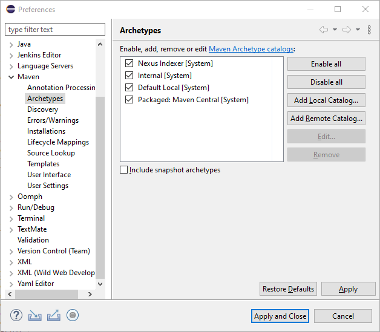
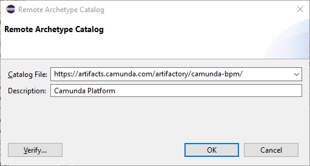
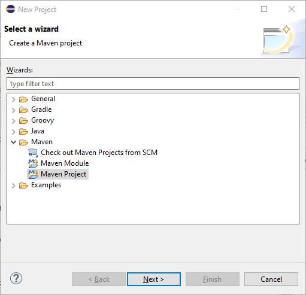
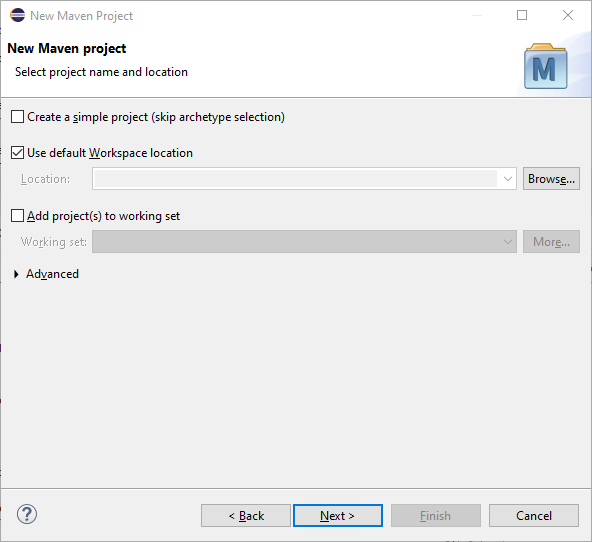
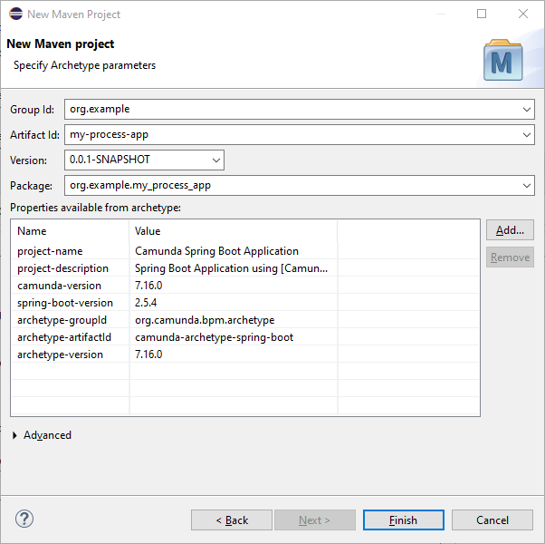
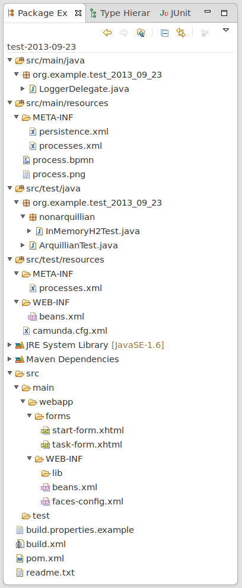

---

title: 'Maven Project Templates (Archetypes)'
sidebar_position: 40

menu:
  main:
    identifier: "user-guide-process-application-archetypes"
    parent: "user-guide-process-applications"

---

We provide several project templates for Maven, which are also called Archetypes.
They enable a quickstart for developing production-ready process applications using Operaton.
We incorporated best practices for different application types into the templates to help you start off with a solid base.

The Archetypes can be used to generate projects as detailed in the different usage sections.
In case generating a project from an Archetype on your own is not feasible, we also provide a template GitHub repository for every Archetype.

# Overview of Available Maven Archetypes

The following archetypes are currently provided. They are distributed via our Maven repository: https://artifacts.camunda.com/artifactory/operaton-bpm/

<table class="table table-bordered">
  <thead>
    <tr><th>Archetype</th><th>Description</th></tr>
  </thead>
  <tbody>
    <tr>
      <td><a href="https://artifacts.camunda.com/artifactory/operaton-bpm/org/operaton/bpm/archetype/operaton-archetype-cockpit-plugin/">Operaton Cockpit Plugin</a></td>
      <td>Plugin for Operaton Cockpit, contains REST-Backend, MyBatis database query, HTML and JavaScript frontend, Ant build script for one-click deployment</td>
    </tr>
    <tr>
      <td><a href="https://artifacts.camunda.com/artifactory/operaton-bpm/org/operaton/bpm/archetype/operaton-archetype-ejb-war/">Process Application (EJB, WAR)</a></td>
      <td>Process application that uses a shared Operaton engine in a Java EE Container, e.g., Wildfly.
          Contains: Operaton EJB Client, Operaton CDI Integration, BPMN Process, Java Delegate as CDI bean, HTML5- & JSF-based start and task forms,
          configuration for JPA (Hibernate), JUnit Test with in-memory engine and visual process test coverage, Arquillian Test for Wildfly, Maven Plugins or Ant build script for one-click deployment in Eclipse</td>
    </tr>
    <tr>
      <td><a href="https://artifacts.camunda.com/artifactory/operaton-bpm/org/operaton/bpm/archetype/operaton-archetype-servlet-war/">Process Application (Servlet, WAR)</a></td>
      <td>Process application that uses a shared Operaton engine in a Servlet Container, e.g., Apache Tomcat.
          Contains: Servlet process application, BPMN Process, Java Delegate, HTML5-based start and task forms,
          JUnit Test with in-memory engine, Maven Plugins or Ant build script for one-click deployment in Eclipse</td>
    </tr>
    <tr>
      <td><a href="https://artifacts.camunda.com/artifactory/operaton-bpm/org/operaton/bpm/archetype/operaton-archetype-spring-boot/">Operaton Spring Boot Application</a></td>
      <td>Application that uses the Operaton Spring Boot Starter.
          Contains: Spring Boot Process Application, Operaton Webapps, BPMN Process, Java Delegate, HTML5-based start and task forms,
          JUnit Test with in-memory engine, Maven Plugins for packing as an executable application.</td>
    </tr>
    <tr>
      <td><a href="https://artifacts.camunda.com/artifactory/operaton-bpm/org/operaton/bpm/archetype/operaton-archetype-spring-boot-demo/">Operaton Spring Boot Application with Demo Users</a></td>
      <td>Same as the <i>Spring Boot Application</i> archetype and additionally creates demo users and groups for easy start with the Operaton Webapps (use <code>demo/demo</code> to log in).</td>
    </tr>
    <tr>
      <td><a href="https://artifacts.camunda.com/artifactory/operaton-bpm/org/operaton/bpm/archetype/operaton-archetype-engine-plugin/">Process Engine Plugin</a></td>
      <td>An example for a process engine plugin.
      Contains: Process engine plugin, BPMN Parse Listener that is registered via the plugin, Task Listener that is added to every user task, JUnit Test with in-memory engine.</td>
    </tr>
  </tbody>
</table>

# Template repositories

We provide a template repository for every Operaton Archetype.
Every repository contains a project generated from one specific template.
You can find the whole list on [GitHub](https://github.com/camunda?q=%22operaton-bpm-archetype-%22).

With every new release of the Archetypes, we will update those repositories with a new version as well.
This allows to investigate possible update paths from one Operaton version to another and also enables you to simply update your existing project by pulling in the latest changes.

In case you need more flexibility and customization for your project, you can generate a project on your own using one of the methods detailed in the next sections.

# Usage in Eclipse IDE

## Summary

1. Add archetype catalog (**Preferences -> Maven -> Archetypes -> Add Remote Catalog**):
    **https://artifacts.camunda.com/artifactory/operaton-bpm/**
2. Create Maven project from archetype (**File -> New -> Project... -> Maven -> Maven Project**)

## Detailed Instructions

1. Go to **Preferences -> Maven -> Archetypes -> Add Remote Catalog**
Eclipse Preferences: Maven Archetypes
2. Enter the following URL and description, click on **Verify...** to test the connection and if that worked click on **OK** to save the catalog.

    Catalog File: **https://artifacts.camunda.com/artifactory/operaton-bpm/**

    Description: **Operaton**
Eclipse Preferences: Add Maven Archetype Catalog

Now you should be able to use the archetypes when creating a new Maven project in Eclipse:

1. Go to **File -> New -> Project...** and select **Maven -> Maven Project**
Create new Maven project
2. Select a location for the project or just keep the default setting.
Eclipse: Select Maven project location
3. Select the archetype from the catalog that you created before.
Eclipse: Select Maven archetype from catalog
4. Specify Maven coordinates and Operaton version and finish the project creation.
Eclipse: Specify Maven coordinates and Operaton version

The resulting project should look like this:

Generated Maven Project in Eclipse

## Troubleshooting

Sometimes the creation of the very first Maven project fails in Eclipse. If that happens to you, just try it again. Most of the times the second try works. If the problem persists, [contact us](https://forum.operaton.org/).

# Usage in IntelliJ IDEA

1. On the "Welcome to IntelliJ IDEA" screen, click on "Configure" and select "Plugins" in the dropdown.
2. In the plugins dialog, click on "Browse repositories...".
3. Search for the plugin "Maven Archetype Catalogs" and click on "Install".
4. Restart IntelliJ IDEA.
5. On the "Welcome to IntelliJ IDEA" screen, click on "Configure" and select "Preferences" in the dropdown.
6. In the preferences window, navigate to: "Build, Execution, Deployment > Build Tools > Maven Archetype Catalogs".
7. In the Maven Archetype Catalogs window, click on the "+" button, and in the opened "Add Archetype Catalog URL"
   modal window add the  URL of the catalog file: https://artifacts.camunda.com/artifactory/operaton-bpm/archetype-catalog.xml.
8. To create a Maven project from an archetype, click on the "Welcome to IntelliJ IDEA" screen on "Create New Project".
9. In the new project dialog, click on the left side on "Maven", check "Create from archetype"
   and select any `org.operaton.bpm.archetype` entry.

# Usage on Command Line

## Interactive

Run the following command in a terminal to generate a project. Maven will allow you to select an archetype and ask you for all parameters needed to configure it:

<pre class="console">
mvn archetype:generate -Dfilter=org.operaton.bpm.archetype:
</pre>

## Full Automation

The following command completely automates the project generation and can be used in shell scripts or Ant builds:
<pre class="console">
mvn archetype:generate \
  -DinteractiveMode=false \
  -DarchetypeGroupId=org.operaton.bpm.archetype \
  -DarchetypeArtifactId=operaton-archetype-ejb-war \
  -DarchetypeVersion=7.10.0 \
  -DgroupId=org.example.operaton.bpm \
  -DartifactId=operaton-bpm-ejb-project \
  -Dversion=0.0.1-SNAPSHOT \
  -Dpackage=org.example.operaton.bpm.ejb
</pre>

# Source Code and Customization

You can also customize the project templates for your own technology stack. Just [fork them on GitHub](https://github.com/operaton/operaton-archetypes)!
