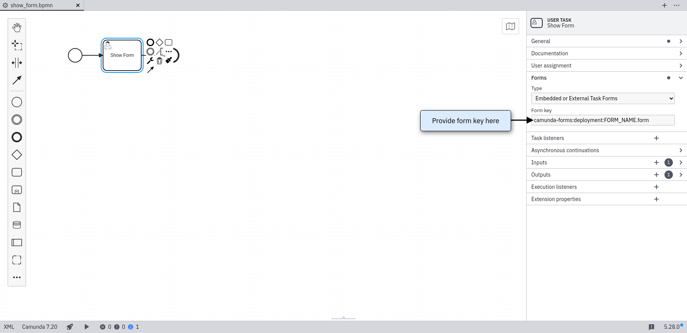
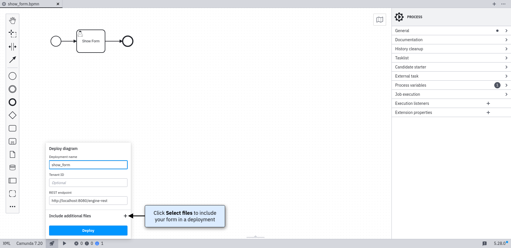
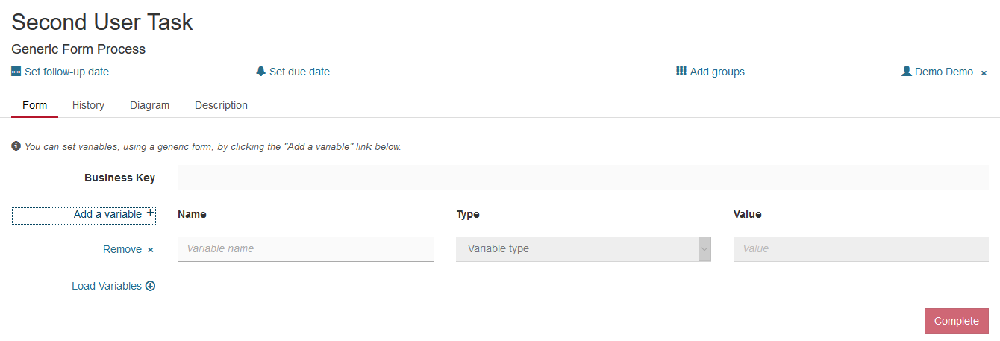
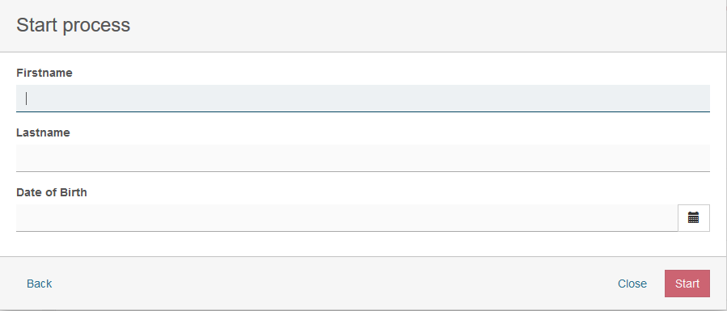

---

title: 'User Task Forms'
sidebar_position: 120

---
# User Task Forms


There are different types of forms which are primarily used in Tasklist. To implement a task form in your application, you have to connect the form resource with the BPMN 2.0 element in your process diagram. Suitable BPMN 2.0 elements for calling tasks forms are the [StartEvent][start-event] and the [UserTask][user-tasks].

Forms are referenced using Form Keys or Form References and can either be embedded in Operaton Tasklist or handled by a custom application. Depending on your use-case, different Form Types can be used:

1. [Embedded Task Forms](#embedded-task-forms) allow you to embed custom HTML and JavaScript forms into Tasklist.
2. [Operaton Forms](#operaton-forms) offer visual editing of forms in the Camunda Modeler and can be used for less complex forms. Operaton Forms are the only form type that can be referenced either by Form Key or by Form Reference.
3. [External Task Forms](#external-task-forms) can be used to link to custom applications. The Form will not be embedded in Tasklist.

If no form key is present, a [Generic Task Form](#generic-task-forms) will be shown.


# Form Key details
Form keys that are used in Tasklist have the structure `FORM-TYPE:LOCATION:FORM.NAME`.

<table class="table table-striped">
  <tr>
    <th>Name</th>
    <th>Description</th>
  </tr>
  <tr>
    <td>FORM-TYPE</td>
    <td>Can be <code>embedded</code> or <code>operaton-forms</code> depending on the form type. If no type is set, the form will be shown as an <a href="#external-task-forms">External Task Form</a>.</td>
  </tr>
  <tr>
    <td>LOCATION</td>
    <td>
      Can be either <code>deployment</code> or <code>app</code>:
      <ul>
        <li><em>deployment</em>: The file is part of your deployment (e.g., <a href="../reference/deployment-descriptors/tags/process-archive.md">by adding it to your process archive</a> or <a href="https://docs.operaton.org/get-started/quick-start/deploy/#use-the-camunda-modeler-to-deploy-the-process">by deploying from the Camunda Modeler</a>), which means that it is stored in the Operaton database. It can then be loaded from there. Note that this allows versioning of your form alongside the process model.</li>
        <li><em>app</em>: Add the file to your development project in a folder <code>src/main/webapp/forms</code>. The form file will be packaged into your deployment artifact (typically a WAR archive). During runtime it will be loaded from there.</li>
      </ul>
    </td>
  </tr>
  <tr>
  <td>FORM.NAME</td>
  <td>The file name and path in the deployment, e.g. <code>forms/startFrom.html</code></td>
  </tr>
</table>


To configure the form in your process, open the process with the [Camunda Modeler](http://operaton.org/bpmn/tool/) and select the desired [UserTask][user-tasks] or [StartEvent][start-event]. Open the properties panel and enter the Form Key. The relevant XML tag looks like this:

```xml
<userTask id="theTask" operaton:formKey="operaton-forms:deployment:forms/userTask.form"
          operaton:candidateUsers="John, Mary"
          name="my Task">
```

# Embedded Task Forms

Embedded task forms are HTML and JavaScript forms. We provide more information about the creation of embedded forms in our [Embedded Task Forms Reference](../reference/forms/embedded-forms/index.md).

To add an embedded form to your application, simply create an HTML file and refer to it from a [UserTask][user-tasks] or a [StartEvent][start-event] in your process model. For example, you can create a `FORM_NAME.html` file containing the relevant content for your form, e.g., a simple form with two input fields:

```html
<form role="form" name="form">
  <div class="form-group">
    <label for="customerId-field">Customer ID</label>
    <input required
           cam-variable-name="customerId"
           cam-variable-type="String"
           class="form-control" />
  </div>
  <div class="form-group">
    <label for="amount-field">Amount</label>
    <input cam-variable-name="amount"
           cam-variable-type="Double"
           class="form-control" />
  </div>
</form>
```

The form key for this file could be `embedded:deployment:FORM_NAME.html` or `embedded:app:forms/FORM_NAME.html`.

# Operaton Forms

Operaton Forms are created as separate files using the Camunda Modeler and can be deployed together with the process models. The form schema is stored in `.form` files.  You can find out how to build Operaton Forms in the [Camunda Modeler documentation](../modeler/forms.md) or refer to the [Operaton Forms Reference](https://docs.camunda.io/docs/guides/utilizing-forms/) to explore all configuration options for form elements.

[Process variables](../user-guide/process-engine/variables.md) are mapped to form fields where the field's key matches the variable name.

:::warning[Process variables access]
Defining forms does not introduce any permissions on process variables.
Users can still submit any variables via APIs for form completion like the
restref page="submit" text="Submit Task Form" tag="Task REST API.
Forms can be used on top of the task completion API to render form fields and validate submitted values.
:::

## Form Reference

With Form References, Operaton Forms provide a flexible way of linking an element in a BPMN diagram to a form. To link a BPMN element ([StartEvent][start-event] or [UserTask][user-tasks]) to a Operaton Form, you have to specify the Id of the Operaton Form as the `operaton:formRef` attribute. Additionally, the `operaton:formRefBinding` attribute specifies which version of the Operaton Form to reference.

Valid values are:

* `deployment`, which references the Operaton Form with the given key that was deployed with the same deployment as the referencing process.
* `latest`, which will refer to the latest deployed version of the Operaton Form.
*  `version`, which allows you to specify a specific version to be referenced from the BPMN element with the `operaton:formRefVersion` attribute.

```xml
<bpmn:userTask
    id="myUserTask"
    operaton:formRef="formId"
    operaton:formRefBinding="version"
    operaton:formRefVersion="1">
</bpmn:userTask>
```

The attributes `operaton:formRef` and `operaton:formRefVersion` can be specified as an expression which will be evaluated on execution of the task or start event.

```xml
<bpmn:userTask
    id="myUserTask"
    operaton:formRef="${formId}"
    operaton:formRefBinding="version"
    operaton:formRefVersion="${formVersion}">
</bpmn:userTask>
```

Provide Form Key for Operaton Forms

## Form Key

Aa an alternative to `formRef` you can reference a Operaton Form file with a `deployment` or `app` [form key](../user-guide/task-forms/index.md#form-key-details):

* `operaton-forms:deployment:FORM_NAME.form`
* `operaton-forms:app:forms/FORM_NAME.form`

To enter the `formKey` in the Modeler,  you have to select `Embedded or External Task Forms` as Type in the dropdown.

From the form developers point of view, `formRef` offers more flexibility than `formKey` as they can be deployed independently from the process model.

## Process Variable Binding

To define a default value for a form field, a process variable with the same name as the form field key needs to be defined. Local variables (e.g. created by defining an [Input Parameter](../process-engine/variables/#input-output-variable-mapping) for the User Task) take precedence over process variables.

User Input/Output Mappings for default values for form fields

The submitted values of a form are returned as variables to the process engine:

* When a process variable with the same name as the form field key already existed, then its value will be overwritten by the form submission.
* When the User Task has an Input Parameter defined with the same name as the form field key, then this local variable will be used. In this case, an [Output Parameter](../process-engine/variables/#input-output-variable-mapping) needs to be defined to map the local variable to a process variable for usage in other process elements.
* When no variable exists with the same name as the form field key, then a new process variable will be created and gets the value from the submission.

## Dynamic Components

You can bind the available options of some component types (Select, Radio Buttons, Checklist, and Taglist) to a variable.
Like this, Operaton Forms show available options dynamically based on process data (variables).

To bind a variable to a dynamic component, define its name in Camunda Modeler's form builder in the Properties Panel under **Options Source** -> **Type** -> **Input Data** -> **Dynamic options** -> **Input values key** for the respective component.

Operaton Forms support the following variable types that can represent JSON:

* `Json`
* `Object` with the `serializationDataFormat: application/json`

Operaton Forms store and retrieve user selections for each component in a variable whose name equals the component key.
If a variable supposed to store the user selection for multi-select components (Checklist or Taglist) doesn't exist yet, a new one is created on form submission with the same type as the variable that defines the available options.

The format to define available options looks as follows:

```json
[
  {
    "label": "Dynamic Value 1",
    "value": "dynamicValue1"
  },
  {
    "label": "Dynamic Value 2",
    "value": "dynamicValue2"
  }
]
```

If you are about to prototype your application, you can also use the shortcut format:

```json
["Dynamic Value 2", "Dynamic Value 2"]
```

## Deployment
If you want to include your Operaton Form as part of the `deployment`, then you need to deploy the `.form` file in the same deployment as the respective `.bpmn` diagram - for example using the Camunda Modeler (since Modeler Version 5.0.0).

:::warning[Automatic deployment]
Operaton Forms are not automatically deployed as part of a [process archive](../reference/deployment-descriptors/tags/process-archive.md) by default.
You need to configure it accordingly by adding it as a resource directly or by adding `form` to the list of `additionalResourceSuffixes`.
Using [Operaton Run](../user-guide/operaton-bpm-run.md#starting-with-operaton-platform-run), all additional resources - including Operaton Forms -
placed inside the `configuration/resources/` directory are automatically deployed.
:::

Deploy your Operaton Form file

You can also include Operaton Forms from other deployments by using [form references](#form-reference).

# External Task Forms
:::note[Using Task Forms outside of Operaton Tasklist]
  When embedding the process engine into a custom application, you can use any value in the form key property as a reference to your custom form. This way, your front-end can ensure to render the correct form for each user task.
:::

If you want to call a task form that is not part of your application, you can add a reference to the desired form. The referenced task form will be configured in a way similar to the embedded task form. Open the properties view and enter `FORM_NAME.html` as form key. The relevant XML tag looks like this:

```xml
<userTask id="theTask" operaton:formKey="app:FORM_NAME.html"
          operaton:candidateUsers="John, Mary"
          name="my Task">
```

Tasklist creates the URL by the pattern:

```xml
"../.." + contextPath (of process application) + "/" + "app" + formKey (from BPMN 2.0 XML) + "processDefinitionKey=" + processDefinitionKey + "&callbackUrl=" + callbackUrl;
```

When you have completed the task, the call back URL will be called.

:::note[How To]
  [How to add JSF Forms to your process application](../user-guide/task-forms/jsf-task-forms.md)
:::


# Other Task Forms
These Task forms do not use the form-key attribute to be referenced. They are not recommended for production use and are intended for testing and development purposes.

## Generic Task Forms

The generic form will be used whenever you have not added a dedicated form for a [UserTask][user-tasks] or a [StartEvent][start-event].

Generic Start Form


Hit the *Add a variable* button to add a variable that will be passed to the process instance upon task completion. State a variable name, select the type and enter the desired value. Enter as many variables as you need.
After hitting the *Complete* button, the process instance contains the entered values. Generic task forms can be very helpful during the development stage, so you do not need to implement all task forms before you can run a workflow. For debugging and testing this concept has many benefits as well.

You can also retrieve already existing variables of the process instance by clicking the *Load Variables* button.


[user-tasks]: ../reference/bpmn20/tasks/user-task.md
[start-event]: ../reference/bpmn20/events/start-events.md
[jsf-task-forms]: ../user-guide/task-forms/jsf-task-forms.md

## Generated Task Forms

:::note[Operaton Forms or Generated Task Forms?]
  The feature set of Operaton Forms and Generated Task Forms are similar. For new projects, we recommend to use Operaton Forms, as they offer more flexibility and are easier to create.
:::


The Operaton process engine supports generating HTML task forms based on Form Data Metadata provided in the BPMN 2.0 XML. Form Data Metadata is a set of BPMN 2.0 vendor extensions provided by Operaton, allowing you to define form fields directly in the BPMN 2.0 XML:

```xml
<userTask id="usertask" name="Task">
  <extensionElements>
    <operaton:formData>
        <operaton:formField
            id="firstname" label="First Name" type="string">
            <operaton:validation>
               <operaton:constraint name="maxlength" config="25" />
               <operaton:constraint name="required" />
            </operaton:validation>
        </operaton:formField>
        <operaton:formField
            id="lastname" label="Last Name" type="string">
            <operaton:validation>
               <operaton:constraint name="maxlength" config="25" />
               <operaton:constraint name="required" />
            </operaton:validation>
        </operaton:formField>
        <operaton:formField
            id="dateOfBirth" label="Date of Birth" type="date" />
    </operaton:formData>
  </extensionElements>
</userTask>
```

Form metadata can be graphically edited using the [Camunda Modeler](https://camunda.com/products/operaton-platform/modeler/).

This form would look like this in Tasklist:

Generated Form

As you can see, the `<operaton:formData ... />` element is provided as a child element of the BPMN `<extensionElements>` element. Form metadata consists of multiple form fields which represent individual input fields where a user has to provide some value or selection.

A form data can have following attributes:

<table class="table table-bordered">
  <thead>
    <tr>
      <th>Attribute</th><th>Explanation</th>
    </tr>
  </thead>
  <tbody>
    <tr>
      <td>businessKey</td>
      <td>Id of a form field that will be marked as <code>cam-business-key</code></td>
    </tr>
  </tbody>
</table>


### Form Fields

:::warning[Process variables access]
Defining form fields does not introduce any permissions on process variables.
Users can still submit any variables via APIs for form completion like the
restref page="submit" text="Submit Task Form" tag="Task REST API.
Form fields can be used on top of the task completion API to render forms and validate submitted values.
:::

A form field can have the following attributes:

<table class="table table-bordered">
  <thead>
    <tr>
      <th>Attribute</th><th>Explanation</th>
    </tr>
  </thead>
  <tbody>
    <tr>
      <td>id</td><td>Unique id of the form field, corresponding to the name of the process variable to which the value of the form field is added when the form is submitted.</td>
    </tr>
    <tr>
      <td>label</td>
      <td>The label to be displayed next to the form field.</td>
    </tr>
    <tr>
      <td>type</td>
      <td>
        The data type of the form field. The following types are supported out of the box:
        <ul>
          <code>
          <li>string</li>
          <li>long</li>
          <li>date</li>
          <li>boolean</li>
          <li>enum</li>
          </code>
        </ul>
      </td>
    </tr>
    <tr>
      <td>defaultValue</td>
      <td>Value to be used as a default (pre-selection) for the field.</td>
    </tr>
  </tbody>
</table>


### Form Field Validation

Validation can be used for specifying frontend and backend validation of form fields. Operaton provides a set of built-in form field validators and an extension point for plugging in custom validators.

Validation can be configured for each form field in the BPMN 2.0 XML:

```xml
<operaton:formField
    id="firstname" label="First Name" type="string">
    <operaton:validation>
       <operaton:constraint name="maxlength" config="25" />
       <operaton:constraint name="required" />
    </operaton:validation>
</operaton:formField>
```

As you can see, you can provide a list of validation constraints for each form field.

The following built-in validators are supported out of the box:

<table class="table table-bordered">
  <thead>
    <tr>
      <th>Validator</th><th>Explanation</th>
    </tr>
  </thead>
  <tbody>
    <tr>
      <td>required</td>
      <td>
        <p>Applicable to all types. Validates that a value is provided for the form field. Rejects 'null' values and empty strings.</p>
        <p>
          <code>
            &lt;operaton:constraint name=&quot;required&quot; /&gt;
          </code>
        </p>
      </td>
    </tr>
    <tr>
      <td>minlength</td>
      <td>
        <p>Applicable to <code>string</code> fields. Validates the minimum length of text content. Accepts 'null' values.</p>
        <p>
          <code>
            &lt;operaton:constraint name=&quot;minlength&quot; config=&quot;4&quot; /&gt;
          </code>
        </p>
      </td>
    </tr>
    <tr>
      <td>maxlength</td>
      <td>
        <p>Applicable to <code>string</code> fields. Validates the maximum length of text content. Accepts 'null' values.</p>
        <p>
          <code>
            &lt;operaton:constraint name=&quot;maxlength&quot; config=&quot;25&quot; /&gt;
          </code>
        </p>
      </td>
    </tr>
    <tr>
      <td>min</td>
      <td>
        <p>Applicable to numeric fields. Validates the minimum value of a number. Accepts 'null' values.</p>
        <p>
          <code>
            &lt;operaton:constraint name=&quot;min&quot; config=&quot;1000&quot; /&gt;
          </code>
        </p>
      </td>
    </tr>
    <tr>
      <td>max</td>
      <td>
        <p>Applicable to numeric fields. Validates the maximum value of a number. Accepts 'null' values.</p>
        <p>
          <code>
            &lt;operaton:constraint name=&quot;max&quot; config=&quot;10000&quot; /&gt;
          </code>
        </p>
      </td>
    </tr>
    <tr>
      <td>readonly</td>
      <td>
        <p>Applicable to all types. Makes sure no input is submitted for the given form field.</p>
        <p>
          <code>
            &lt;operaton:constraint name=&quot;readonly&quot; /&gt;
          </code>
        </p>
      </td>
    </tr>
  </tbody>
</table>

Operaton supports custom validators. Custom validators are referenced using their fully qualified classname or an expression. Expressions can be used for resolving Spring or CDI @Named beans:

```xml
<operaton:formField
    id="firstname" label="First Name" type="string">
    <operaton:validation>
       <operaton:constraint name="validator" config="com.asdf.MyCustomValidator" />
       <operaton:constraint name="validator" config="${validatorBean}" />
    </operaton:validation>
</operaton:formField>
```

:::note
  The name attribute must be set to "validator" in order to use custom form field validator.
:::

A custom validator implements the `org.operaton.bpm.engine.impl.form.validator.FormFieldValidator` interface:

```java
public class CustomValidator implements FormFieldValidator {

  public boolean validate(Object submittedValue, FormFieldValidatorContext validatorContext) {

    // ... do some custom validation of the submittedValue

    // get access to the current execution
    DelegateExecution e = validatorContext.getExecution();

    // get access to all form fields submitted in the form submit
    Map<String,Object> completeSubmit = validatorContext.getSubmittedValues();

  }

}
```

If the process definition is deployed as part of a ProcessApplication deployment, the validator instance is resolved using the process application classloader and / or the process application Spring Application Context / CDI Bean Manager, in case of an expression.
