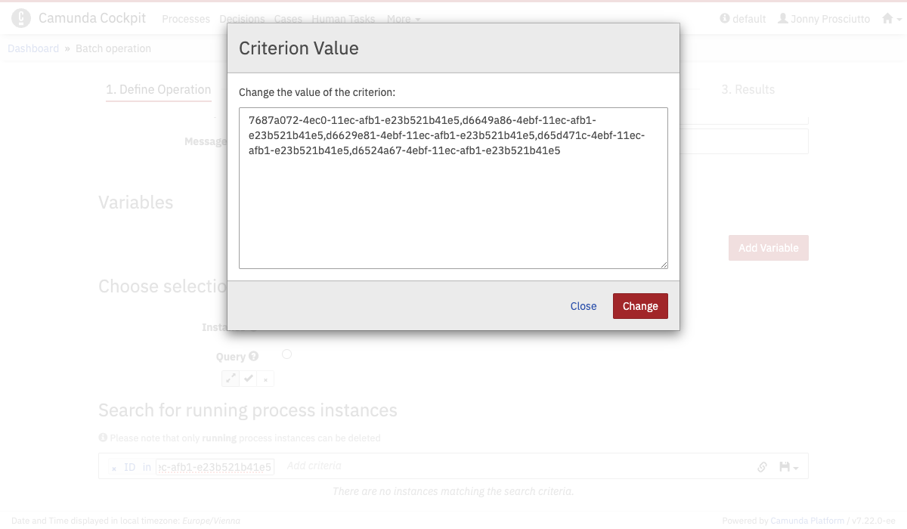

---

title: 'Batch operation'
sidebar_position: 10

menu:
  main:
    identifier: "user-guide-cockpit-batches-operations"
    parent: "user-guide-cockpit-batch"
    description: "Perform batch operations"

---

# Definition Of operation

![Example img](./../img/batch/batch_operation_definition.png" alt="Batch Operation Definition" caption="

It is possible to execute the following batch operations:

- Delete running process instances. 
- Delete finished process instances.
- Set retries of Jobs belonging to process instances.
- Set retries of external tasks belonging to process instances.
- Set variables to process instances.
- Suspend running process instances.
- Activate suspended process instances.
- Delete decision instances.
- Set a Removal Time to Historic Process Instances.
- Set a Removal Time to Historic Decision Instances.
- Set a Removal Time to Historic Batches.
- Correlate Message.

After selecting the operation, fields may appear with additional data that is either optional or required to perform the operation. When canceling running process instances, you can optionally select to skip custom listeners and provide a cancelation reason. 

Next, you can define the instances affected by the batch operation. Initially, all instances are displayed. You can use the filter bar above the list of instances to filter the displayed instances.
You can select specific instances or click on the **Query** radio button to select all instances matching the filter.

:::warning[Warning]">}}
Selecting all instances might create a high load on the database and application runtime/server if the query has a high number of results.
:::

You can copy a link to the current search query to your clipboard by clicking on the <button class="btn btn-xs"><i class="glyphicon glyphicon-link"></i></button> button and you can save search queries to your local browser storage by clicking on the <button class="btn btn-xs"><i class="glyphicon glyphicon-floppy-disk"></i></button> button and inserting a name in the drop down menu that appears. You can then retrieve the search query by clicking on the <button class="btn btn-xs"><i class="glyphicon glyphicon-floppy-disk"></i></button> button and selecting the chosen name in the drop down menu.

Please note that 
some operations can only be executed on running instances, while others can only be executed on finished instances. You will see an
appropriate notice once the operation type is selected. 

Navigation to the next step is disabled as long as all required data to perform the operation is not filled out.

IN Operator

Cockpit provides `IN` operator support when filtering for process instances for the following query criteria:

* Process instance ID
* Business key
* Process definition key
* Variable value

By default, the criteria defined in the search are linked together with a logical `AND` ([conjunctive normal form](https://en.wikipedia.org/wiki/Conjunctive_normal_form)).
Occasionally, you may search for multiple query criterion values. The `IN` operator allows searching for multiple values where any of the values match.

To use the `IN` operator, select a query criterion that supports the `IN` operator, and provide the values as a comma-separated list. To adjust the comma-separated list of values,
start editing by clicking on the value. You can expand the value in a modal dialog for easier editing by clicking on the <button class="btn btn-xs"><i class="glyphicon glyphicon-resize-full"></i></button> button.

IN Operator Modal

:::note[Heads-up!]
  The instance search operates on the history endpoint of the engine. In case the requested historic data is not persisted to the database, then the search does not deliver the desired results.
:::

# Confirmation of operation

. In case of error, this screen will display a corresponding error message.
