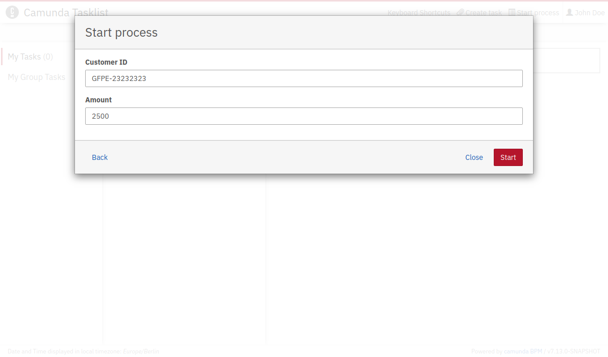
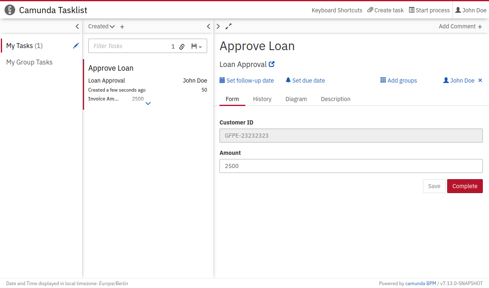

---

title: 'Adding Start and Task Forms to a BPMN 2.0 Process'
sidebar_position: 50

menu:
  main:
    name: "Forms"
    parent: "get-started-pa"
    identifier: "get-started-pa-forms"
    description: "Add simple Forms to the Process."

---

In the next step, we want to add a task form to the application.


# Add a Start Form

Create a new form in Camunda Modeler and set its id to `request-loan`.

Add a **Text Field**, set the **Field Label** to `Customer ID` and the **Key** to `customerId`.

Add a **Number Field**, set the **Field Label** to `Amount` and the **Key** to `amount`.

Save the form with the file name `request-loan.form` to `src/main/resources`.

.

Open the process with the modeler. Click on the start event. In the properties panel, click on `Forms` select `Operaton Forms` as type, insert `request-loan` into the `Form reference` field, and choose `latest` as binding. This means Tasklist uses the latest deployed version of the form. Save the diagram and refresh the Eclipse project.


# Add a Task Form

You can add and configure the task form in a similar way with the difference,
that you set its id to `approve-loan` and select the **Disabled** checkbox in both fields.

Save the form with the file name `approve-loan.form` to `src/main/resources`.

After that, open the process with the modeler. Click on the user task. In the properties panel, click on `Forms` select `Operaton Forms` as type, insert `approve-loan` into the `Form reference` field, and choose `latest` as binding.

# Adjust the deployment descriptor file

Adjust the `META-INF/processes.xml` deployment descriptor file by adding the form resources:

```xml

<?xml version="1.0" encoding="UTF-8" ?>

<process-application
        xmlns="http://www.operaton.org/schema/1.0/ProcessApplication"
        xmlns:xsi="http://www.w3.org/2001/XMLSchema-instance">

  <process-archive name="loan-approval">
    <process-engine>default</process-engine>

    <resource>loan-approval.bpmn</resource>
    <resource>request-loan.form</resource>
    <resource>approve-loan.form</resource>

    <properties>
      <property name="isDeleteUponUndeploy">false</property>
      <property name="isScanForProcessDefinitions">true</property>
    </properties>
  </process-archive>

</process-application>
```

# Re-Build and Deploy

When you are done, save all resources, [perform a Maven build](../deploy/#build-the-web-application-with-maven) and [redeploy](../deploy/#deploy-to-apache-tomcat) the process application.

:::note[Maven]
Before selecting the pom.xml in the Package Explorer of Eclipse and performing a right-click and select Run As / Maven Install, it is best practice to perform a right-click and select Run As / Maven Clean to make sure all resources are replaced with their newest version.
:::

Now you go to [Tasklist](http://localhost:8080/operaton/app/tasklist) and start a new process instance for the loan approval process. You will notice that the custom form is displayed.



After starting a new process instance a new task `Approve Loan` is assigned to john. To work on the task, select the task inside the list of tasks and you will also notice that the custom form is displayed.


