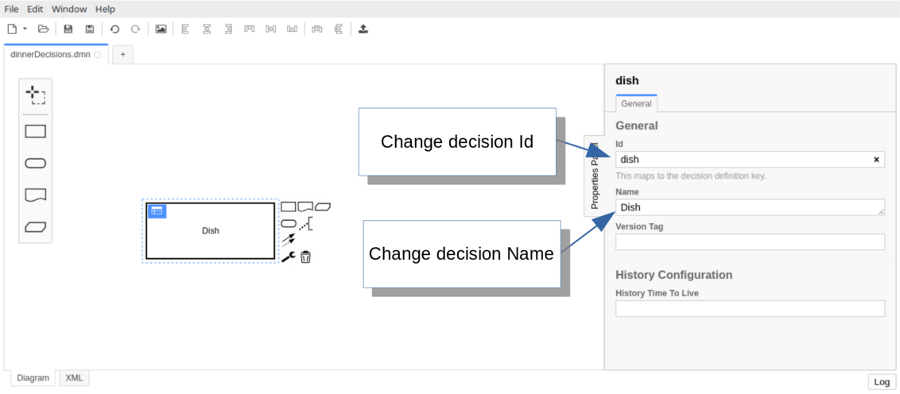
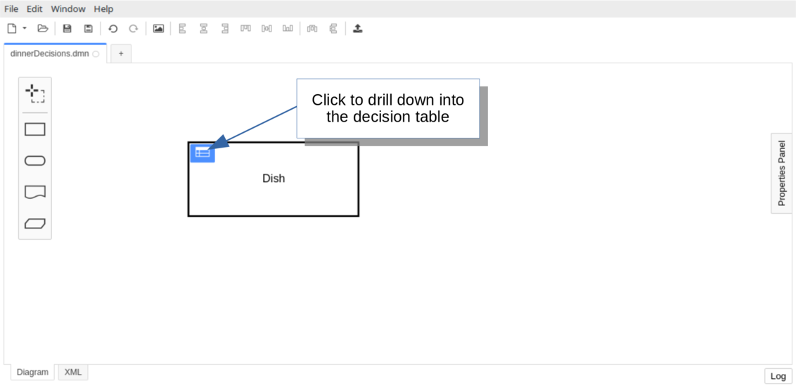
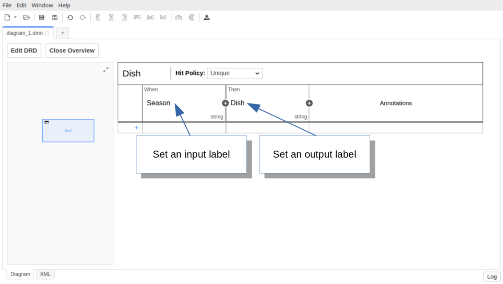
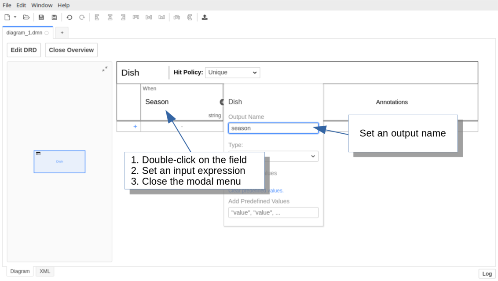
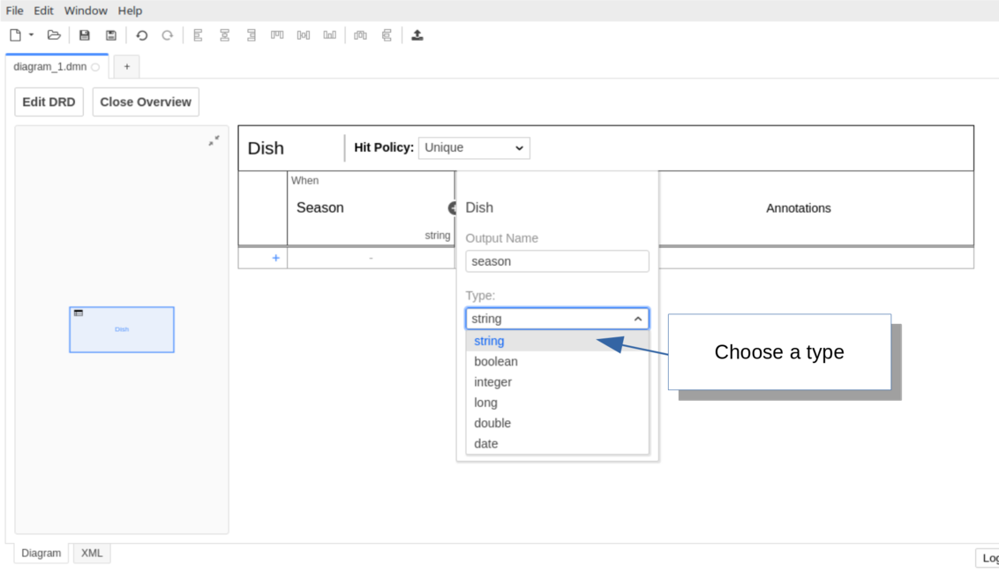
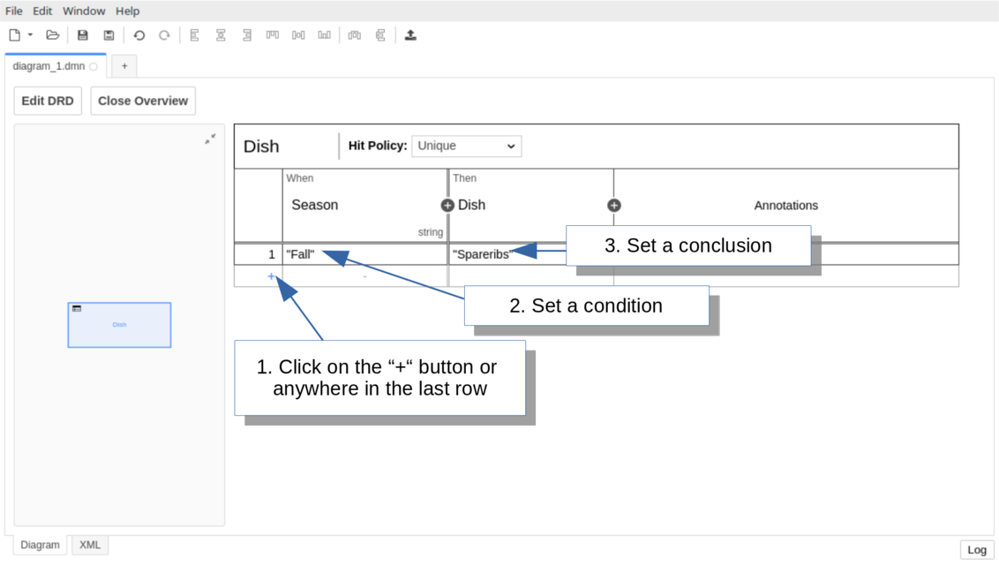
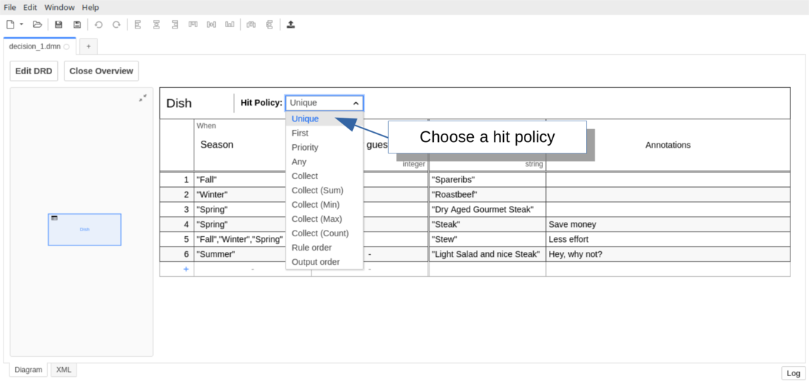
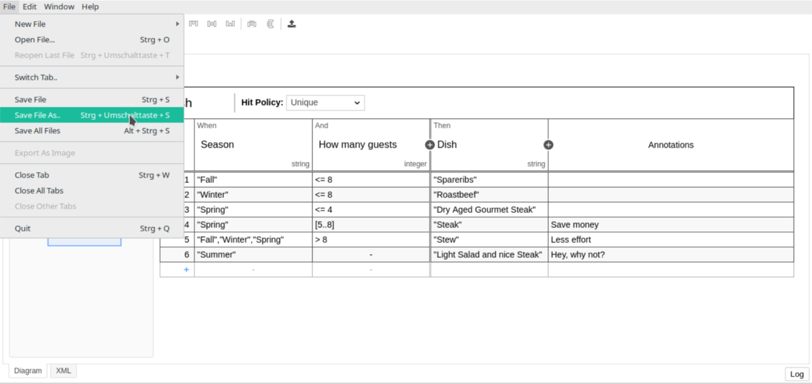

---

title: 'Create a DMN Decision Table'
sidebar_position: 30

menu:
  main:
    name: "Create a Decision Table"
    parent: "get-started-dmn"
    identifier: "get-started-dmn-model"
    description: "Learn the basics of handling the Camunda Modeler and learn how to create and configure a fully executable decision table."

aliases: [/dmn11/model/]
---

In this section you learn how to create your first [DMN Decision Table](/manual/latest/reference/dmn11/decision-table/) with the Camunda Modeler. The table will contain the decision logic about the desired dish for a given season and guest count.

Now start up the Camunda Modeler.

# Create a new Decision Diagram

Create a new DMN diagram by clicking *File > New File > DMN Diagram*.

# Start with the Table Header

Start by setting the name and the id of the decision. Select the decision, open the Properties Panel on the right side and change the text to "dish" as the technical [id of the decision](/manual/latest/reference/dmn11/decision-table/#decision-id) which is used to reference the decision inside the process application.

Next, click on the field below and set the [name of the decision](/manual/latest/reference/dmn11/decision-table/#decision-name) to "Dish".

Now drill down into the decision table of the newly created decision by clicking the table icon on top of the decision.

To set the [label of the input](/manual/latest/reference/dmn11/decision-table/input/#input-label) double-click on the field under "When" and type "Season" in the uppermost field. Same for the [output label](/manual/latest/reference/dmn11/decision-table/output/#output-label), double-click on the field under "Then" and type "Dish" in the uppermost field.

# Configure the Input Expression and the Output Name

Assuming that the input value for "Season" is provided by a variable with name "season", the [input expression](/manual/latest/reference/dmn11/decision-table/input/#input-expression) should be "season".

Double-click on the "Season" field. In the modal menu that pops up, set "season" as expression and close it.

Next, double-click on the "Dish" field and set "desiredDish" as [output name](/manual/latest/reference/dmn11/decision-table/output/#output-name).

# Configure the Type of the Input and Output

Assuming that the input value for "Season" is provided as String, the [type of the input value](/manual/latest/reference/dmn11/decision-table/input/#input-type-definition) should be "string".

Double-click on the "Season" column header. Open the "Type" dropdown-menu in the modal menu and select "string".

Same for the [output type](/manual/latest/reference/dmn11/decision-table/output/#output-type-definition), double-click on the "Dish" column header and choose "string" as type.

# Add Rules

Now, add the first [rule](/manual/latest/reference/dmn11/decision-table/rule/) that specifies that the desired dish for season "Fall" is "Spareribs".

Click on the "+" button at the bottom of the table or just click anywhere on the last row. In the row that was added, type "Fall" in the input column and "Spareribs" in the output column.

"Fall" is the condition (i.e., [input entry](/manual/latest/reference/dmn11/decision-table/rule/#input-entry-condition)) of the rule. It is an expression in [FEEL](/manual/latest/reference/dmn11/feel/) which is applied and then checks if the input value (i.e., the variable "season") is equal to "Fall".

"Spareribs" is the conclusion (i.e., [output entry](/manual/latest/reference/dmn11/decision-table/rule/#output-entry-conclusion)) of the rule. It is a simple expression in JUEL and returns the String "Spareribs".

Next, add a second input "How many guests" with the input expression "guestCount" and type "integer". Fill the table with additional rules for the remaining seasons.

# Configure the Hit Policy

Set the [hit policy](/manual/latest/reference/dmn11/decision-table/hit-policy/) to "UNIQUE", which specifies that only one rule can match. Verify that the decision table contains only one rule that can match the inputs.

Click on the "Hit Policy" dropdown and choose the hit policy "UNIQUE".

:::note[Default Hit Policy]
The default hit policy is "UNIQUE". If your rules are disjunct so only one rule can match then you don't need to change the hit policy.
:::

# Save the Decision Table

When you are done, save your changes by clicking *File > Save File As..*. In the dialogue that pops up, navigate to the application project directory (by default this is in your Eclipse workspace path). In the project directory, place the model in the `src/main/resources` folder.

Return to Eclipse. Right-click the project folder and click *Refresh*. This synchronizes the new DMN file with Eclipse.

For Eclipse to automatically synchronize the workspace with the filesystem, consider [configuring auto-sync in eclipse][auto-sync].

[auto-sync]: /manual/latest/modeler/tips/#eclipse-project-synchronization
