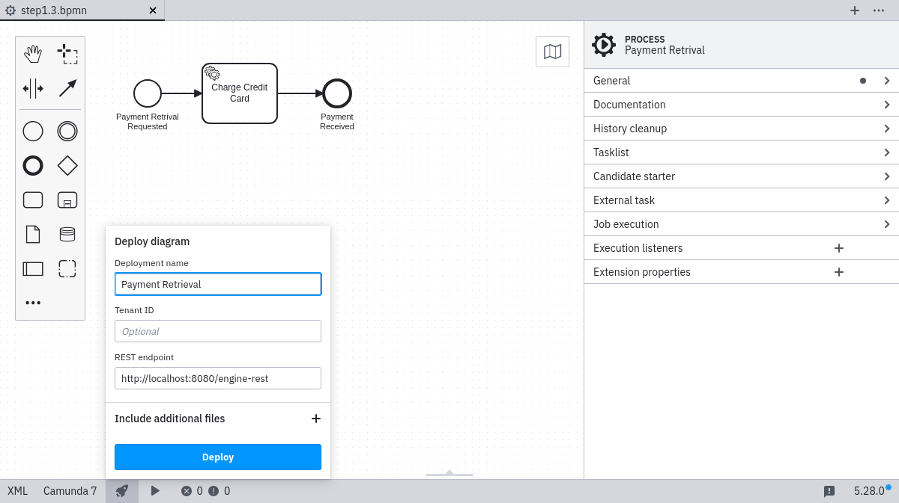

---

title: 'Deploy the Process'
sidebar_position: 3
description: 'Deploy the Process to Operaton and start your first process instance.'

---
# Deploy the Process (3/6)

In the next step, you'll deploy the Process and start a new instance so you can see that your simple process is working correctly.

:::note[Deployment Support]
BPMN diagrams must be created for the process engine they intend to be deployed on. You cannot run a BPMN diagram modeled for Operaton Platform in Operaton Cloud, or vice versa, at this time.
:::

# Use the Camunda Modeler to Deploy the Process

In order to deploy the Process, click on the deploy button in the Camunda Modeler, then give it the Deployment Name "Payment Retrieval" and click the Deploy button. From version 3.0.0 on, you will be required to provide an URL for an Endpoint Configuration along with Deployment Details. This can be either the root endpoint to the REST API (e.g. `http://localhost:8080/engine-rest`) or an exact endpoint to the deployment creation method (e.g. `http://localhost:8080/engine-rest/deployment/create`).



You should see a success message in the Camunda Modeler:


More details regarding the deployment from Camunda Modeler you can find [here](https://blog.camunda.com/post/2019/01/camunda-modeler-3.0.0-0-released/#completely-reworked-deployment-tool). For Camunda Modeler 2.2.4 and earlier, read [this blog post](https://blog.operaton.com/post/2018/03/camunda-modeler-1120-alpha-3-released/).

# Verify the Deployment with Cockpit

Next, use Cockpit to see if the process was successfully deployed. Go to [http://localhost:8080/operaton/app/cockpit/](http://localhost:8080/operaton/app/cockpit/) and log in with the credentials demo / demo. Your process *Payment Retrieval* should be visible on the dashboard.


# Start a Process Instance

In Operaton, there are different ways to start a new process instance.
You can leverage the Operaton REST API to start a new process instance by sending a POST Request.

## a) curl

```sh
curl -H "Content-Type: application/json" -X POST -d '{"variables": {"amount": {"value":555,"type":"integer"}, "item": {"value":"item-xyz"} } }' http://localhost:8080/engine-rest/process-definition/key/payment-retrieval/start
```

In your worker, you should now see the output in your console.
This means you have successfully started and executed your first simple process.

## b) REST Client

If you don't feel comfortable using curl for the REST request, you can instead make use of any REST client.

Make a POST request to the following endpoint:
`http://localhost:8080/engine-rest/process-definition/key/payment-retrieval/start`

The JSON Body should look like this:
```JSON
{
	"variables": {
		"amount": {
			"value":555,
			"type":"integer"
		},
		"item": {
			"value": "item-xyz"
		}
	}
}
```

*Hint:* Make sure you are setting the headers correctly to `Content-Type: application/json`


Here's what the request might look like in Postman:


In your worker console (which we started in the previous section), you should now see an output.
This means you have successfully started and executed your first simple process.

:::note[Next Step]
In some cases, we'll want to involve humans in our process. Move onto the next step to [learn how you can involve humans in your process](/docs/get-started/quick-start/user-task/).
:::
