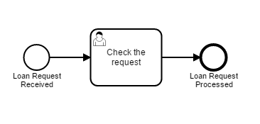

---

title: 'Modeling a BPMN 2.0 Process'
sidebar_position: 30

menu:
  main:
    name: "Model a Process"
    parent: "get-started-spring-boot"
    identifier: "get-started-spring-boot-model"
    description: "Learn the basics of handling the Camunda Modeler and learn how to model and configure a fully executable process."

---

In this section we learn how to deploy a process and invoke a Spring Bean from a BPMN 2.0 Service Task.

# Deploy and Invoke BPMN Process

Now that we know how to bootstrap the process engine within a Spring Boot Application, we can add a BPMN 2.0 process
model and interact with the process from inside our Spring beans. In this section, we will

1. Model an executable BPMN 2.0 process.
2. Use Spring Boot Starter auto-deployment for BPMN 2.0 processes.
3. Create a process application.
4. Start a process instance from our process application.

## Model an Executable BPMN 2.0 Process and Deploy It

Start by modeling an executable process using the Camunda Modeler. The process should look as depicted in the screenshot below.



:::note[Hint]
If you are unfamiliar with modeling an executable process, you can read the
[Model a Process](../quick-start/service-task.md) section of the *Quick Start* tutorial.
:::

When you are done, save the process model in the `src/main/resources` folder of your Eclipse project. Make sure to refresh the Eclipse project afterwards.

Once it is saved in the application classpath, it will be automatically deployed on engine startup.

## Create Process Application

We recommend to declare the process application in your Operaton Spring Boot application, which gives additional configuration possibilities and will help us in the current demo
to catch the "post-deploy" event to start the process instance at that point.

To declare the process application, just add the `@EnableProcessApplication` annotation on your `WebappExampleProcessApplication` class and put the empty `processes.xml` file in the
`src/main/resources/META-INF` folder. The file is required by the Operaton Engine for every process application, but in our case it will stay empty.

## Start a Process Instance after Process Application has been Deployed

The next step consists of starting a process instance from our process application class. For this, we will process `PostDeployEvent`, which is fired as soon as
our process application has been deployed to the Operaton engine.

```java
...
  @Autowired
  private RuntimeService runtimeService;

  @EventListener
  private void processPostDeploy(PostDeployEvent event) {
    runtimeService.startProcessInstanceByKey("loanApproval");
  }
...
```

Note that we can easily inject the Operaton engine service via the `@Autowired` annotation.

## Rebuild and test

If you rebuild and restart the application, you should see the task "Check the request" in Tasklist under the "All tasks" filter:

